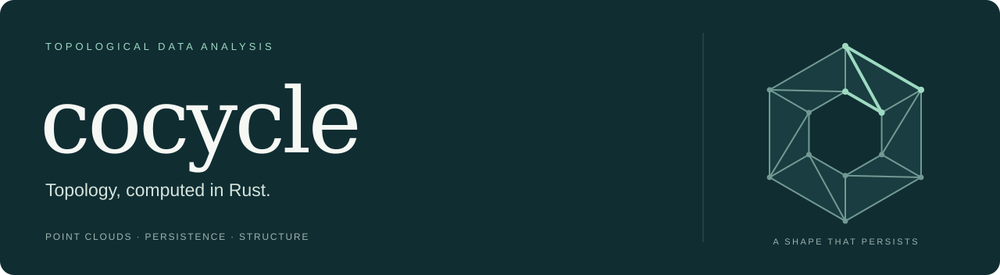
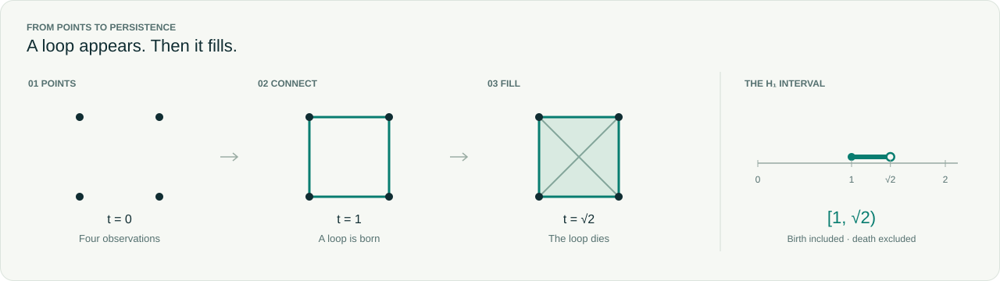

[](https://github.com/huangbogeng/cocycle-rs/actions/workflows/ci.yml)
[](Cargo.toml)
[](LICENSE)

**Find structure across scales.** Cocycle turns point clouds and pairwise
dissimilarities into persistence diagrams: which components and loops appear,
and how long they last. A general-purpose TDA library in pure Rust, with no runtime
dependencies and no unsafe code.

- **Rips persistence** — ordinary H₀/H₁ over F₂, using union-find and implicit
  persistent cohomology. Euclidean points or precomputed dissimilarities.
- **Meaningful results** — owned diagrams preserve multiplicity and distinguish
  finite deaths, essential classes, and right-censored intervals.
- **Useful summaries** — finite lifetimes, persistence entropy in nats, and Betti
  curves, computed directly from a diagram.



## Quick start

**Rust 1.91+ · Pre-release.** Not yet published on crates.io; use the Git dependency:

```toml
[dependencies]
cocycle = { git = "https://github.com/huangbogeng/cocycle-rs", branch = "main" }
```

```rust
use cocycle::descriptors::betti_curve;
use cocycle::geometry::PointCloudView;
use cocycle::persistence::{RipsOptions, rips_from_points};

fn main() -> cocycle::Result<()> {
    let square = [0., 0., 1., 0., 1., 1., 0., 1.];
    let points = PointCloudView::new(&square, 4, 2)?;
    let diagram = rips_from_points(points, &RipsOptions::default())?;
    assert_eq!(betti_curve(&diagram, 1, &[0., 1., 2.])?, [0, 1, 0]);
    Ok(())
}
```

The square's H₁ interval is `[1, sqrt(2))`. Scales are **edge lengths**; a class
surviving an incomplete cutoff is censored, not dead. Your application's
`Cargo.lock` pins the resolved Git commit. See the [user guide](docs/guide.md)
for cutoffs, input layouts, and result semantics.

## Explore

[User guide](docs/guide.md) · [Mathematics](docs/mathematics.md) ·
[Architecture](docs/architecture.md) · [Benchmarks](benches/README.md) ·
[Contributing](CONTRIBUTING.md) · [Roadmap](docs/roadmap.md)

Build the API reference with `cargo doc --no-deps --open`, or run the example with
`cargo run --locked --example square`. Higher homology dimensions and representative
cycles are not implemented. Work and memory depend on the input and reduction
fill-in; the benchmarks include difficult cases and comparisons with GUDHI and Ripser.py.

[Issue tracker](https://github.com/huangbogeng/cocycle-rs/issues) ·
Code and original artwork are [MIT licensed](LICENSE).
